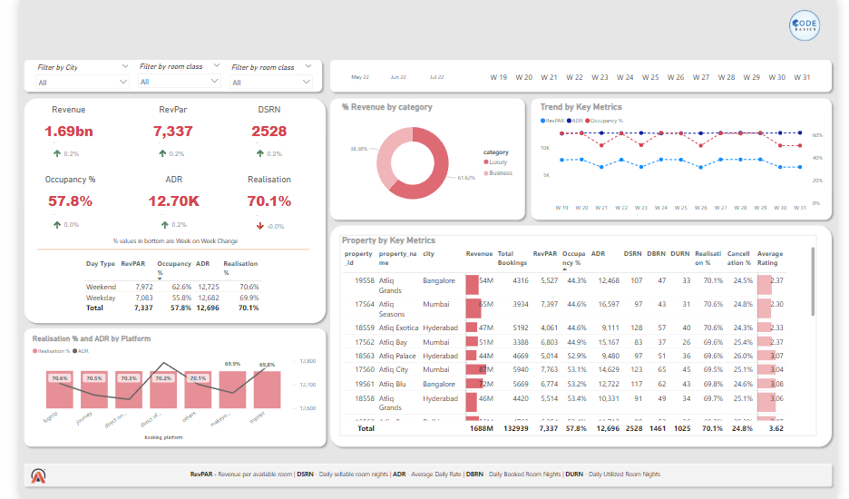
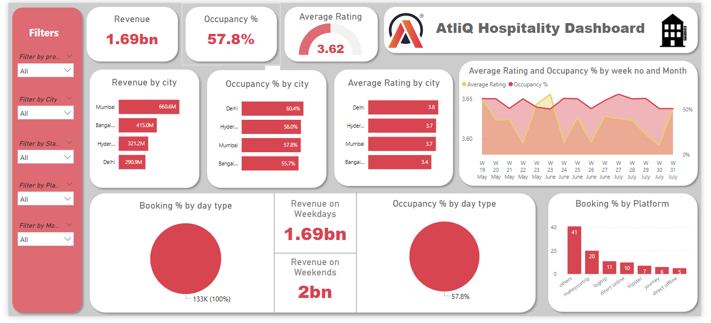
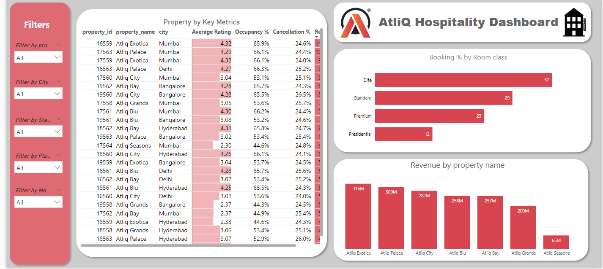

# Revenue-Insights-in-Hospitality-Domain

This project is a comprehensive dashboard for AtliQ Hospitality, designed to visualize and analyze key performance metrics of hotels. The dashboard provides insights into revenue, occupancy, bookings, and customer feedback across various dimensions such as city, property, and room class. 

---

## Project Overview
The AtliQ Hospitality Dashboard aims to simplify hotel performance monitoring through interactive visualizations. Stakeholders can filter data by city, property, and platform, making it easier to understand trends in revenue, occupancy rates, booking platforms, and customer feedback.

---

## Features
- **Revenue Tracking:** Analyze revenue by city, day type (weekday/weekend), and booking platform.
- **Occupancy Insights:** View occupancy percentage by city and room type.
- **Customer Feedback:** Monitor average customer ratings and cancellation rates.
- **Trend Analysis:** Track trends over weeks for key metrics like revenue and occupancy.
- **Filter Options:** Filter data by city, property, room class, and more.

---

## Datasets
The project leverages the following datasets:

1. **dim_date.csv**  
   Contains date-related dimensions, including day type and week number.
   
2. **dim_hotels.csv**  
   Provides information on hotel properties, including city and category (Luxury/Business).

3. **dim_rooms.csv**  
   Details about room categories and classifications (e.g., Standard, Elite).

4. **fact_aggregated_bookings.csv**  
   Aggregated booking data such as successful bookings and room capacity.

5. **fact_bookings.csv**  
   Transactional data including booking status, platform, and revenue.

---
## Dashboard Visualizations

#### 1. Home Page
The **Home Page** displays overall performance metrics like:
- **Total Revenue**: Insights into revenue generated by properties.
- **Occupancy Rate**: The percentage of booked rooms across properties.
- **Average Rating**: Feedback provided by customers.

**Key Widgets:**
- Revenue by city.
- Occupancy percentage.
- Booking by platform.

  

---

#### 2. Detailed Metrics
The **Detailed Metrics** section allows users to:
- Drill down into data for individual properties.
- View performance metrics by **day type** (weekday/weekend) and **room class**.
- Analyze trends for revenue and occupancy over weeks.

  

---

#### 3. Filters
The **Filters** feature provides dynamic filtering options to refine data visualizations:
- Filter by **Property**, **City**, **State**, **Platform**, or **Month**.
- Gain deeper insights based on specific criteria.

  

---

## Technologies Used
- **Power BI**: Dashboard creation and data visualization.
- **Excel**: Data preparation and validation.

---
